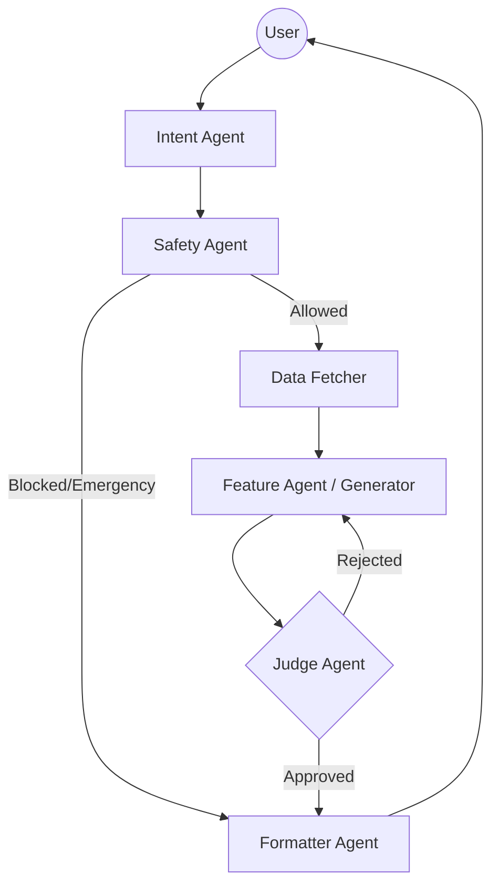

# 🏥 SenioCare: Elderly Healthcare Assistant

> **A specialized, intelligent agent system designed to provide safe, personalized, and warm healthcare support for elderly users in Egypt.**

---

## 📖 Overview

**SenioCare** is an advanced AI-powered healthcare assistant built to bridge the gap between complex medical information and elderly users. It leverages a **multi-agent architecture** to ensure every interaction is:
1.  **Safe**: Strictly screened for medical emergencies and unsafe requests.
2.  **Personalized**: Tailored to the user's specific health profile (conditions, medications, allergies).
3.  **Culturally Adapted**: Delivered in warm, respectful **Egyptian Arabic**.
4.  **Accurate**: Validated by a strict "Judge" agent before easy delivery.

### 🌟 Key Features
*   **Sequential Pipeline with Self-Correction**: Implements a rigorous `Intent -> Safety -> Fetch -> Generate -> Judge -> Format` flow.
*   **Emergency Detection**: Automatically detects critical symptoms (chest pain, stroke signs) and directs users to emergency services locally.
*   **Warm Persona**: Speaks like a caring family member ("حضرتك", "يا فندم") using Egyptian dialect.
*   **Comprehensive Support**: Handles Meal Planning, Medication Reminders, Exercise Routines, and General Health Q&A.

---

## 🏗️ Architecture

SenioCare uses the **Google Agent Development Kit (ADK)** to orchestrate a team of specialized agents:



### 🧩 The Agent Team

| Agent | Responsibility |
|-------|----------------|
| **Intent Agent** | Classifies requests into `meal`, `medication`, `exercise`, `emergency`, etc. |
| **Safety Agent** | Guardrail that blocks diagnosis requests and detects emergencies. |
| **Data Fetcher** | Retrieves user profile (diabetes, hypertension, etc.) from the database. |
| **Feature Agent** | The "medical brain" that uses tools to generate health advice. |
| **Judge Agent** | Quality Assurance loop that rejects vague or unsafe advice. |
| **Formatter Agent** | The "voice" that translates everything into warm Egyptian Arabic. |

---

## 🚀 Getting Started

### Prerequisites
*   Python 3.10+
*   Google GenAI SDK / ADK installed

### Installation

1.  **Clone the repository**
    ```bash
    git clone https://github.com/yourusername/SenioCare.git
    cd SenioCare
    ```

2.  **Install dependencies**
    ```bash
    pip install -r requirements.txt
    ```

3.  **Set up environment variables**
    Create a `.env` file in the root directory:
    ```env
    GOOGLE_API_KEY=your_api_key_here
    ```

### Running the Agent
Run the main agent server using the ADK CLI:
```bash
adk run seniocare.agent:root_agent
```
Or for the web interface:
```bash
adk web seniocare.agent:root_agent
```

---

## 🤝 Usage Examples

**User:** "أنا جوعان وعندي سكر، آكل إيه؟" (I'm hungry and have diabetes, what should I eat?)
**SenioCare:** verifies safety, checks diabetes profile, suggests a low-glycemic meal (e.g., Grilled Chicken & Salad), validates nutritional safety, and replies:
> "يا فندم، عشان صحة حضرتك والسكر، أنا بنصحك بوجبة فراخ مشوية مع سلطة خضرا 🥗..."

**User:** "عندي وجع جامد في صدري" (I have severe chest pain)
**SenioCare:** Detects **EMERGENCY**, bypasses normal flow:
> "🚨 يا فندم ده ممكن يكون طارئ! لو سمحت اتصل بالإسعاف فوراً..."

---

## 🛡️ Safety & Disclaimer

This system is designed for **informational and support purposes only**.
*   ❌ It does **NOT** provide medical diagnosis.
*   ❌ It does **NOT** prescribe medications.
*   ✅ It **ALWAYS** advises users to consult their healthcare provider.

---

## 📄 License
[MIT License](LICENSE)
