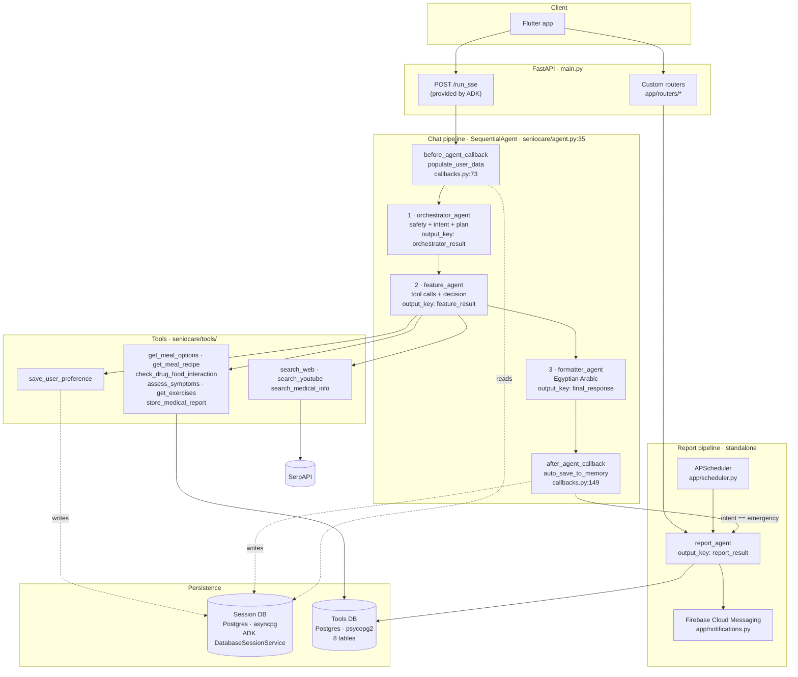

# SenioCare — Architecture

**Scope:** what the code does today, traceable to `file:line`. Planned work is not described here. Known defects are linked to `docs/AUDIT.md` rather than restated.

**Version:** `APP_VERSION = "3.1.0"` (`app/config.py:22`) · ADK 1.22.0

---

## 1. System overview

SenioCare is a FastAPI service wrapping a three-stage Google ADK agent pipeline. A user message enters over `/run_sse`, passes through three sequential LLM stages, and returns an Egyptian Arabic response. A separate, standalone fourth agent generates health reports on a schedule or on demand.

**Note on this diagram versus the previous one.** The earlier README diagram drew an edge from the Orchestrator directly to the Formatter, labelled `BLOCKED / EMERGENCY`. That edge does not exist. `SequentialAgent` (`seniocare/agent.py:35-43`) runs all three sub-agents unconditionally. The diagram above reflects the real, unconditional path. See `docs/AUDIT.md` **C-02**.

---

## 2. Call graph — one chat request

| # | Hop | File:line |
|---|---|---|
| 1 | `POST /run_sse` — route provided by ADK's `get_fast_api_app` | `main.py:38-44` |
| 2 | Import of the `seniocare` package creates and seeds all tables | `seniocare/agent.py:27-30` → `seniocare/data/database.py:83` |
| 3 | ADK loads the session from Postgres | `app/config.py:90` |
| 4 | `before_agent_callback` → `populate_user_data` | `seniocare/callbacks.py:73` |
| 4a | Inject fabricated test profile if `user:user_id` is absent | `seniocare/callbacks.py:86-94` — see **C-11** |
| 4b | Increment turn counter | `seniocare/callbacks.py:108-109` |
| 4c | Build `conversation_history` from the last 12 events | `seniocare/callbacks.py:114-120` |
| 5 | **Stage 1 — Orchestrator.** Prompt interpolates `{conversation_history}` and `{user:preferences}` | `seniocare/sub_agents/orchestrator_agent.py:313`; templates at `:39`, `:42` |
| 6 | Writes `orchestrator_result` | `orchestrator_agent.py:318` |
| 7 | **Stage 2 — Feature.** Prompt interpolates `{orchestrator_result}` | `feature_agent.py:307`; template at `:63` |
| 8 | ADK dispatches tool calls against the 10 registered tools | `feature_agent.py:312-323` |
| 8a | Each DB tool opens its own connection and closes it | `seniocare/data/database.py:71` |
| 9 | Writes `feature_result` | `feature_agent.py:324` |
| 10 | **Stage 3 — Formatter.** Prompt interpolates `{feature_result}` | `formatter_agent.py:229`; template at `:50` |
| 11 | Writes `final_response` | `formatter_agent.py:234` |
| 12 | `after_agent_callback` → `auto_save_to_memory` | `seniocare/callbacks.py:149` |
| 12a | Generate session headline (turn 1 only) | `seniocare/callbacks.py:157-181` |
| 12b | If `INTENT: emergency`, spawn background report + FCM task | `seniocare/callbacks.py:183-185` → `:213-248` |
| 12c | Memory save attempt — always fails, memory is disabled | `seniocare/callbacks.py:187-194`; `app/config.py:63` |
| 13 | SSE events stream to the client | — |

The client renders only events whose author is `formatter_agent`. That contract is visible in the chat-history reader at `app/routers/chat_history.py:82`.

**Three LLM round-trips per turn.** Every request pays all three regardless of complexity; a bare preference statement costs the same as a full meal plan.

---

## 3. Stage responsibilities

### Stage 1 — Orchestrator (`seniocare/sub_agents/orchestrator_agent.py`)

Reasoning only; no tools bound.

| Responsibility | Prompt location |
|---|---|
| Safety screen → `EMERGENCY` / `BLOCKED` / `ALLOWED` | `:67-116` |
| Intent classification into 11 categories | `:118-161` |
| Task planning naming tools and parameters | `:163-277` |
| Structured output block | `:279-306` |

Emits labelled free text (`SAFETY_STATUS:`, `INTENT:`, `USER_CONTEXT:`, `TASK_PLAN:`). **Only `INTENT` is ever read by Python**, via one regex at `seniocare/callbacks.py:208`. `SAFETY_STATUS` has no consumer in the codebase — see **C-03**.

The prompt documents two tools that do not exist (`:225`, `:232`) — see **C-06**.

### Stage 2 — Feature (`seniocare/sub_agents/feature_agent.py`)

Executes the plan, selects among options, packages results.

Ten tools bound at `:312-323`. Per-intent workflows at `:155-225`. Output contract at `:228-273`.

Its output is **never parsed** — it is passed verbatim as a string into stage 3's prompt.

### Stage 3 — Formatter (`seniocare/sub_agents/formatter_agent.py`)

The only stage whose output the user sees (`:26`).

Templates exist for five response types:

| Response type | Template |
|---|---|
| `meal_recommendation` | `:99-125` |
| `exercise_plan` | `:127-145` |
| `preference_saved` | `:147-155` |
| `symptom_alert` | `:157-172` |
| `medical_qa` | `:174-183` |
| `emergency` | `:68-79` |
| `blocked` | `:81-91` |

**No template exists for `emotional_support` or `routine`**, both of which are valid upstream intents (`orchestrator_agent.py:134`, `:136`) and one of which is a declared response type (`feature_agent.py:233`). Those paths reach the Formatter with no template to follow.

### Report agent (`seniocare/sub_agents/report_agent.py`)

Standalone; not part of the chat pipeline (`:8`). Invoked through a manually constructed `Runner` with a fresh `InMemorySessionService` per call (`seniocare/tools/reports.py:433-438`).

Four triggers:
1. `POST /reports/generate` — `app/routers/reports.py:22`
2. APScheduler daily 23:00 / weekly Sun 23:00 / monthly 1st 23:00 — `app/scheduler.py:184-208`
3. Emergency detected in chat — `seniocare/callbacks.py:184`
4. Direct call to `generate_report` — `seniocare/tools/reports.py:336`

Emits markdown prefixed by a `STATUS:` line, parsed at `reports.py:503`.

---

## 4. Model configuration

All four agents use the same model, hardcoded in four separate files:

| Agent | File:line | Model |
|---|---|---|
| Orchestrator | `orchestrator_agent.py:315` | `ollama_chat/gemma4:e4b` |
| Feature | `feature_agent.py:309` | `ollama_chat/gemma4:e4b` |
| Formatter | `formatter_agent.py:231` | `ollama_chat/gemma4:e4b` |
| Report | `report_agent.py:133` | `ollama_chat/gemma4:e4b` |

**No generation parameters are set at any call site** — no `temperature`, `max_tokens`, `top_p`, or `generate_content_config`. All calls use LiteLLM/Ollama defaults.

There is no environment variable for the model name and no `OLLAMA_API_BASE` setting anywhere in the repo. Changing the model or pointing at a remote Ollama host requires editing source in four places.

---

## 5. State flow

### Storage tiers

| Tier | Prefix | Lifetime | Backed by |
|---|---|---|---|
| Session state | none | one session | Postgres via ADK |
| User state | `user:` | all sessions for that user | Postgres via ADK |
| Stage handoff | none (`output_key`) | one invocation | session state |
| Event log | — | one session | Postgres via ADK |
| Tools data | — | permanent | Postgres via `psycopg2` |

### Keys in use

**`user:`-scoped** — written by `POST /set-user-profile` (`app/routers/user_profile.py:43-56`), read by tools and prompts:

`user:user_id`, `user:user_name`, `user:age`, `user:weight`, `user:height`, `user:gender`, `user:chronicDiseases`, `user:allergies`, `user:medications`, `user:mobilityStatus`, `user:bloodType`, `user:caregiver_ids`, `user:caregivers`, `user:preferences`

**Session-scoped:**

| Key | Written | Read |
|---|---|---|
| `orchestrator_result` | `orchestrator_agent.py:318` | `feature_agent.py:63`, `callbacks.py:154` |
| `feature_result` | `feature_agent.py:324` | `formatter_agent.py:50` |
| `final_response` | `formatter_agent.py:234` | — (streamed to client) |
| `conversation_turn_count` | `callbacks.py:109` | `callbacks.py:158` |
| `conversation_history` | `callbacks.py:114-120` | `orchestrator_agent.py:39` |
| `session_headline` | `callbacks.py:175` | `chat_history.py:34` |
| `session_preview` | `callbacks.py:176` | `chat_history.py:35` |
| `_meal_tool_called` | `nutrition.py:29` | `nutrition.py:24` |
| `_recipe_tool_called` | `nutrition.py:166` | `nutrition.py:161` |
| `_interaction_tool_called` | `interactions.py:27` | `interactions.py:22` |
| `_symptom_tool_called` | `symptoms.py:30` | `symptoms.py:25` |
| `_store_report_tool_called` | `image_tools.py:48` | `image_tools.py:43` |

The five `_*_tool_called` flags carry no `temp:` prefix and are never reset, so they persist for the whole session rather than the turn — see **C-04**.

### The temp-session pattern

Reading or writing `user:`-scoped state outside an agent invocation is done by creating a throwaway session, reading its state, and deleting it. Eight call sites use this:

`user_profile.py:36`, `:88`, `:172`, `:196`, `:229` · `reports.py:103` · `scheduler.py:82` · `tools/reports.py:155`

Each costs two or three database round-trips to read one dictionary. Orphaned temp sessions leak into chat history because the filter at `chat_history.py:29` matches only the `_profile_` prefix — see **R-06**.

---

## 6. Data model

### Tools database — `seniocare/data/database.py:119-222`

| Table | Purpose | Seed rows |
|---|---|---|
| `meals` | Meals with nutrition and recipes | 19 |
| `condition_dietary_rules` | Nutrient ceilings per condition | — |
| `drug_food_interactions` | Drug↔food effects and severity | 20 |
| `disease_symptoms` | Disease→symptom lists with severity | 15 |
| `disease_precautions` | Precautions per disease | — |
| `food_allergens` | Food→allergen category | 23 |
| `exercises` | Exercises by mobility level | — |
| `medical_reports` | Stored image-analysis results | — |
| `health_reports` | Generated reports (`tools/reports.py:42-57`) | — |

Seeds load from `seniocare/data/seeds/*.json`.

**Every column is `TEXT`**, including JSON payloads (`ingredients TEXT`, `database.py:126`) and timestamps (`generated_at TEXT`, `reports.py:54`). Report date filtering is therefore string comparison.

Seven indexes exist (`database.py:225-231`, `reports.py:58-68`). One is defeated by a function on the indexed column at `interactions.py:67`.

Schema is created by `CREATE TABLE IF NOT EXISTS` at import time. **There is no migration tool** — `IF NOT EXISTS` never alters an existing table, so schema changes cannot be applied to a live database.

### Session database

Managed entirely by ADK's `DatabaseSessionService` (`app/config.py:90`). The URL is rewritten at `app/config.py:45-59` to add the `+asyncpg` driver prefix and strip `sslmode` / `channel_binding`, which asyncpg does not accept as URL parameters.

`MEMORY_SERVICE_URI` is `None` (`app/config.py:63`) — ADK memory supports only Vertex AI Memory Bank URIs, not Postgres. Cross-session continuity is therefore carried entirely by `user:`-prefixed state.

---

## 7. HTTP surface

### Custom endpoints

| Method | Path | Handler |
|---|---|---|
| GET | `/health` | `app/routers/health.py:10` |
| POST | `/create-session` | `app/routers/sessions.py:14` |
| GET | `/chat-history/{user_id}` | `app/routers/chat_history.py:11` |
| GET | `/chat-history/{user_id}/{session_id}` | `app/routers/chat_history.py:50` |
| POST | `/set-user-profile/{user_id}` | `app/routers/user_profile.py:27` |
| GET | `/get-user-profile/{user_id}` | `app/routers/user_profile.py:78` |
| POST | `/sync-user-profile/{user_id}` | `app/routers/user_profile.py:130` |
| POST | `/register-caregiver-fcm` | `app/routers/user_profile.py:186` |
| POST | `/reports/generate` | `app/routers/reports.py:22` |
| GET | `/reports/{user_id}` | `app/routers/reports.py:141` |
| GET | `/reports/{user_id}/{report_id}` | `app/routers/reports.py:173` |
| GET | `/reports/medical/{user_id}` | `app/routers/reports.py:200` — **unreachable, see C-16** |
| POST | `/reports/seed` | `app/routers/reports.py:225` — dev-only, unauthenticated, can delete data |

### ADK-provided endpoints

`/run_sse`, `/list-apps`, `/apps/{app}/users/{user}/sessions/...`, and the dev web UI (`SERVE_WEB_INTERFACE = True`, `app/config.py:85`).

`/run_sse` — the endpoint the Flutter client depends on — **is absent from the Swagger schema**, because `_CUSTOM_PATHS` at `app/openapi.py:13-23` does not list it.

---

## 8. Known limitations

Summarised from `docs/AUDIT.md`. Full detail, triggers, and confidence levels are there.

### Security

- **No authentication on any endpoint** (**C-01**). `user_id` is an unauthenticated path parameter; any caller can read or overwrite any user's medical profile, read their conversations, or attach an FCM token to their emergency alerts.
- **CORS is `"*"`** (`app/config.py:76`).
- **No rate limiting, no audit log, no data-deletion path.**
- `sessions.db` appears in git history, though it is gitignored and untracked now.

### Safety and correctness

- **Safety routing is prose, not control flow** (**C-02**). The Feature Agent executes on the emergency path with all 10 tools bound.
- **`SAFETY_STATUS` is never read** (**C-03**). Escalation depends on one regex matching `INTENT: emergency` verbatim; any deviation silently skips escalation with no log.
- **Tool guards persist across turns** (**C-04**). From turn 2 onward, guarded tools short-circuit — drug-interaction screening silently stops running.
- **Fabricated patient profile injected when identity is missing** (**C-11**).
- **Symptom matching over-matches** (**C-12**). Substring matching plus severity-first sorting means a report of mild dizziness can produce `is_emergency: True`.
- **Symptom database is English-only** while users write Egyptian Arabic (**C-13**).
- **Allergen and drug matching are exact-string** and work only because the 23 seed allergen rows were hand-tuned against the 19 seed meals (**C-14**).
- **Emergency notification is a GC-eligible fire-and-forget task** with no retry, no persistence, and no failure alerting (**C-09**).

### Data and reporting

- **Report date ranges are ignored** for conversation data (**C-07**). Daily and monthly reports aggregate identical inputs.
- **Four aggregation fields are declared, read, and never populated** (**C-08**): `symptoms_reported`, `meals_accessed`, `exercises_accessed`, `interaction_warnings`.
- **Report status silently defaults to `"moderate"`** when the model's `STATUS:` line is missing or unparseable (**C-10**).
- **`GET /reports/medical/{user_id}` always returns 404** due to route shadowing (**C-16**).

### Performance

- **Synchronous `psycopg2` and `requests` called from async handlers** block the event loop (**R-01**).
- **No connection pooling** — a new TCP+TLS connection per query (`database.py:71`).
- **Three N+1 patterns** (**R-02**), the worst being up to 100 queries for a single drug-interaction check.
- **No timeout on any LLM call** (**R-04**).

### Engineering

- **No migrations**, no Docker, no CI, no linter, no type checker.
- **No observability** — no tracing, no metrics, no token or cost accounting, and the two `logging` modules are never configured so their `info` records are discarded.
- **No LLM evaluation.** The 124 tests cover deterministic Python only; none asserts on model output. Scaffolding for this now exists in `evals/`.
- **Test suite does not fully collect** — `tests/integration/test_multi_tool_flows.py` imports the deleted `seniocare.tools.medication`.
- **Prompt/code drift**: two non-existent tools and two unconfigured model names in the Orchestrator prompt; a medication-schedule field referencing a deleted module.

---

## 9. Where to read next

| Question | Document |
|---|---|
| What is broken, and how badly? | `docs/AUDIT.md` |
| How do I measure any of this? | `docs/INSTRUMENTATION.md` |
| How do I test agent behaviour? | `evals/schema.md`, `evals/runner.py` |
| How do I run it? | `README.md` |
